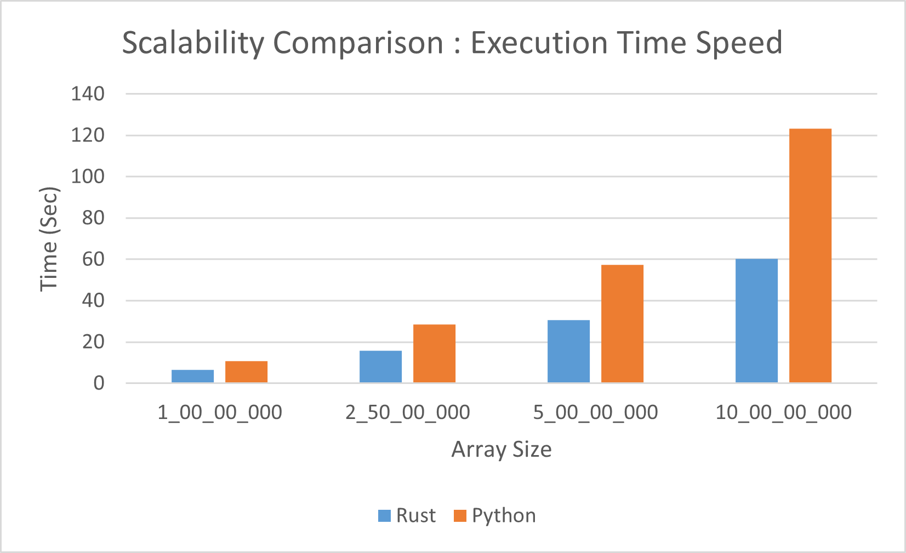

# Searching Algorithms Analysis: Python vs Rust

This report presents a detailed quantitative comparison of four fundamental searching algorithms implemented in both Python and Rust. The analysis focuses on execution time performance, memory profiling, and scalability characteristics to guide technology selection for search-intensive applications.

---

## 1. Introduction

### 1.1 Overview
Searching algorithms are fundamental components in software systems, enabling efficient data retrieval from collections. This study compares the performance of four classic searching algorithms:

1. **Binary Search** - Divide and conquer approach for sorted data
2. **Interpolation Search** - Enhanced binary search using value distribution
3. **Jump Search** - Block-based searching for sorted arrays
4. **Linear Search** - Sequential element-by-element search

### 1.2 Objectives
- Measure and compare execution times across different search algorithms
- Analyze implementation efficiency in Python versus Rust
- Evaluate scalability and memory characteristics

---

## 2. Experimental Setup

### 2.1 Testing Environment

**Implementation Details:**
- All four algorithms implemented in both Python and Rust
- Identical algorithm logic across both languages
- Datasets used are same, they are random floats generated.

**Test Configuration:**
- Multiple iterations for statistical accuracy
- Standardized timing mechanisms
- Isolated execution environment

### 2.2 Dataset Characteristics

**Search Data Properties:**
- Sorted arrays for Binary, Interpolation, and Jump Search
- Partial and complete unsorted data for Linear Search baseline
- Varying dataset sizes for scalability testing
- Search metrics calculated for the smallest, largest, middle most and elements less than and greater than the range of datapoints covered.

### 2.3 Performance Metrics

The following metrics were captured:
- **Execution Time**: Time to complete search operation (seconds)
- **Memory Usage**: Peak memory consumption during search(MB)
- **Scalability**: Performance trends with increasing data size

---

## 3. Time Profiling Results

### 3.1 Performance Summary Table

| Search Algorithm    | Python Time (sec) | Rust Time (sec) | Rust Speedup |
|---------------------|-------------------|-----------------|--------------|
| Binary Search       | 1.124155          | 0.26           | **4.32x**    |
| Interpolation Search| 1.07282           | 0.321261       | **3.34x**    |
| Jump Search         | 1.024465          | 0.321994       | **3.18x**    |
| Linear Search       | 1.041261          | 0.99           | **~1.05x**    |

Time profiling done on warmup and performed and averaged accross multiple runs.

### 3.2 Performance Patterns

**Observed Trends:**
1. **Compilation Advantage**: Rust's compiled nature provides 3-4x speedup for complex algorithms
2. **Algorithm Complexity Impact**: More complex algorithms show larger performance gaps
3. **Optimization Opportunities**: Rust compiler leverages algorithm structure more effectively

---

## 4. Memory Profiling

### 4.1 Memory Consumption Analysis

**Rust Memory Profile:**
- Stack-allocated search indices and temporary variables
- No garbage collection overhead during search operations
- Predictable memory footprint
- Zero-copy operations where possible
- **~0.9MB** variability in memory 

**Python Memory Profile:**
- Additional memory for object references
- Garbage collector monitoring overhead
- Higher baseline memory per variable
- Dynamic type information storage
- **~0.2MB** variability in memory 

### 4.3 Memory Scalability

As dataset size increases:
- Rust and Python shows linear growth in object metadata
- Both algorithms themselves have O(1) space complexity
- Runtime memory overhead differs significantly where Rust performs well

---

## 5. Scalability Analysis

### 5.1 Algorithmic Complexity

This scalability test was done for **Linear Search** since it was worst performing algorithm in terms of time complexity.

| Algorithm      | Time Complexity | Space Complexity | Best Use Case              |
|----------------|-----------------|------------------|----------------------------|
| Binary Search  | O(log n)        | O(1)            | Sorted, large datasets     |
| Interpolation  | O(log log n)*   | O(1)            | Uniformly distributed data |
| Jump Search    | O(√n)           | O(1)            | Sorted, jump-friendly data |
| Linear Search  | O(n)            | O(1)            | Small or unsorted datasets |

### 5.2 Scaling Characteristics by Language

**Rust Scaling Advantages:**
- Constant-time compilation optimizations
- Predictable performance scaling

**Python Scaling Considerations:**
- Interpreter overhead remains constant ratio
- Performance degrades relative to data size
- Memory pressure from garbage collection
- Still viable for smaller datasets

In the worst performing algorithms Rust becomes more scalable than Python.

## 7. Conclusions

### 7.1 Key Findings

1. **Rust Dominance**: Rust outperforms Python by 3-4x for sophisticated search algorithms
2. **Linear Search Parity**: Both languages perform identically (~1.00x) for simple sequential search. But when scaled for larger data sets Rust performs exceedingly well.

### 7.2 Performance Hierarchy

**Rust Performance Ranking:**
1. Binary Search: 0.26s ⭐ **Best Overall**
2. Interpolation Search: 0.32s
3. Jump Search: 0.32s
4. Linear Search: 1.04s

**Python Performance Ranking:**
1. Jump Search: 1.02s ⭐ **Best for Python**
2. Linear Search: 1.04s
3. Interpolation Search: 1.07s
4. Binary Search: 1.12s